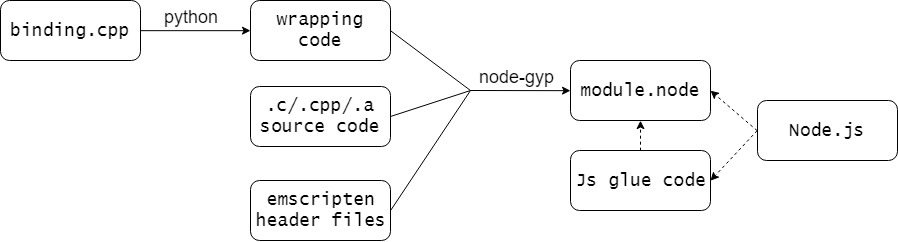
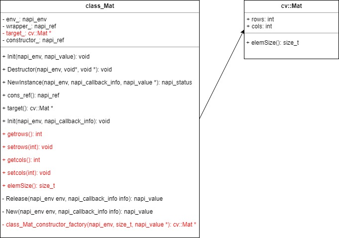

# napi-emscripten
Implementation of webassembly code interfaces based on [node.js c++ napi-addon](https://nodejs.org/dist/latest-v11.x/docs/api/n-api.html).

Webassembly code is generated using [`emscripten`](https://kripken.github.io/emscripten-site/docs/introducing_emscripten/about_emscripten.html)  , which could be invoked by front end or node.js. However, it may not be such efficient as native node.js addon and has some limitations in using. Here we use native node.js addon to implement it **with the same webassembly interfaces**. **Hence, the js application code will be the same as webassembly, but owns more efficiency.**

## Principle
### Emscripten
Emscripten is an Open Source LLVM to JavaScript compiler. With emscripten, we mostly compile C and C++ code into JavaScript, avoiding the high cost of porting code manually.

[Emscripten Compiler Frontend (emcc)](https://kripken.github.io/emscripten-site/docs/tools_reference/emcc.html#emccdoc) acts as a drop-in replacement for a standard compiler like *gcc*.


There are several ways to [connect C/C++ code and JavaScript](https://kripken.github.io/emscripten-site/docs/porting/connecting_cpp_and_javascript/Interacting-with-code.html#interacting-with-code). [WebIDL Binder](https://kripken.github.io/emscripten-site/docs/porting/connecting_cpp_and_javascript/WebIDL-Binder.html) and [Embind](https://kripken.github.io/emscripten-site/docs/porting/connecting_cpp_and_javascript/embind.html) are the main two tools for porting C++ code, allowing C++ code entities to be used in a natural manner from JavaScript. They could also dela with `name-mangled C++ functions`.

Both tools create bindings between C++ and JavaScript, but they operate at different levels, and use very different approaches for defining the binding:

*   Embind declares bindings within the C/C++ file.
*   WebIDL-Binder declares the binding in a separate file. This is run through the binder tool to create "glue" code that is then compiled with the project.

Here, we choose `Embind` for porting C++ projects. There's usually a `binding.cpp` additional to the project, using `EMSCRIPTEN_BINDINGS()` blocks to create bindings for functions, classes, value types, pointers (including both raw and smart pointers), enums, and constants.

### N-API
The `binding.cpp` is also used here to define the interfaces for calling C++ from JavaScript. It will be parsed to structed information to generate the C++ wrapping code. The the C++ wrapping code will be compiled to a node plugin module using `node-gyp`. Then JavaScript code could use the functions and classes in the module. A glue js code may also be required. The main principle is shown as below:




## Details
### Code generation
Besides the origin c++ source code, a `binding.cpp` is required when generating the wrapping code. The flow path is shown as below:
1. Copy the content outside the block `EMSCRIPTEN_BINDINGS` in `binding.cpp` to wrapping code.
2. Generate the fixed part using template.
3. Parsing the declartion in the block `EMSCRIPTEN_BINDINGS`.
4. **Generate code for declared classes, value_objects, value_arrays, functions contants and so on.**
5. Generate the napi declartions for the types generated in step 4.

#### Code parsing
Python module `ply` is used here to parse c++ synax and obtain type declation information in the `binding.cpp`. It collects the information of registered class, object, array, function, constant, vector and so on.

For example, `class Mat` is declared in the binding.cpp of opencv:
```c
emscripten::class_<cv::Mat>("Mat")
    .constructor<>()
    .constructor<const Mat&>()

    .property("rows", &cv::Mat::rows)
    .property("cols", &cv::Mat::cols)
    .function("elemSize", select_overload<size_t()const>(&cv::Mat::elemSize))

    ....
```

Then `Mat` could be used in js:
```js
let mat = new cv.Mat();
console.log(mat.rows);
console.log(mat.elemSize);
```
These information will be transfered into corresponding wrapping code and napi declartions, so that these types and methods could be invoked in node.js code.

The information will be stored in python as a dict. For example, if it is a declared class or value_object, the `jstype` and `cxxtype` will be stored, representing for the js type name and c++ type name of it respectively. But the most important information is the function.  
For example: 
```cpp
.function("convertTo", select_overload<void(const Mat&, Mat&, int, double, double)>(&binding_utils::convertTo))
.function("convertTo", select_overload<void(const Mat&, Mat&, int)>(&binding_utils::convertTo))
.function("convertTo", select_overload<void(const Mat&, Mat&, int, double)>(&binding_utils::convertTo))
```

This is a declartion of three overload functions of 'convertTo'. And it will be parsed to the stuct below:
```python
{'convertTo':[('void',['Mat&', 'int'],'binding_utils::convertTo','const Mat&, Mat&, int'),
              ('void',['Mat&', 'int', 'double'],'binding_utils::convertTo','const Mat&, Mat&, int, double'),
              ('void',['Mat&', 'int', 'double', 'double'],'binding_utils::convertTo','const Mat&, Mat&, int, double, double')]}
```

Key `convertTo` is the js name of the function and value is the list of three overload function information. 
*   `'void'`: return type
*   `['Mat&', 'int']`: args list, c++ code will parse args js code passed in according to this list
*   `'binding_utils::convertTo'`: function name
*   `'const Mat&, Mat&, int'`: additional information, default is None

Class constructor, member function, properity, static function, global function and other types will all parse to this format. The detail is shown below.

#### Wrapping code
Generally, a wrapping class named `class_Mat` will be generated for `cv::Mat`. Its members and functions are shown as below:



`class_Mat` owns a pointer pointing to instance `cv::Mat`. And related functions will be generated corresponding to the members and functions in `cv::Mat`. These functions are dynamiclly generated and marked red. Other functions of `class_Mat` are generated by template.

`class_Mat` will then be declared **a napi class** in the subsequent code. 
```cpp
    napi_define_class(env,
                      "Mat",
                      -1,
                      New,
                      nullptr,
                      sizeof(properties) / sizeof(properties[0]),
                      properties,
                      &cons);

    napi_create_reference(env, cons, 1, &constructor_);

    napi_set_named_property(env, exports, "Mat", cons);
```
Hence, Js code could call create `class_mat` instance and invoke the members and functions by: 
```js
let mat = new cv.Mat();
console.log(mat.rows);
console.log(mat.elemSize);
```
**The Js code is the same as the webassembly one.**

Other declared types in `binding.cpp` are processed similarly and described in details as below.


##### class
Registered classes are defined as c++ classes in the warpping code, and they are declared with `napi_define_class` as wrapped js classes.   

For example, a class named `class_Mat` is corresponding to `cv::Mat` in the source code. 
*   Prefix 'class_' means this c++ class is a class type in js.
*   `class_Mat` owns a pointer to instance `cv::Mat` to invoke its methods.
*   Napi properities defined in `class_Mat` will invoked corresponding constructors, member properties, functions, static functions of `cv::Mat` when they're invoked from js code.
    *   mat.rows(js) ----> class_Mat::getrows/class_Mat::setrows ----> cv::Mat::rows
    *   mat.elemSize(js) ----> class_Mat::elemSize ----> cv::Mat::elemSize
*   As function argument: unwrap from the napi_value to get `cv::Mat`. 
*   As return type: create a napi instance containing `cv::Mat` the c++ returned.

##### value_object
Registered value_objects are also defined as napi class type in the warpping code, but they represent js objects.

For example, a class named `object_Range` is corresponding to `cv::Range`. And it's almostly the same as register classes.
*   Prefix 'object_' means this c++ class is a object type in js.
*   `object_Range` owns a pointer to instance `cv::Range` to invoke its methods.
*   Fields defined in value_object are declared napi_properities in `object_Range`.
*   As return type: create a napi object and set all the properities as fields defined.
*   As function argument: crate a napi instance of `cv::Range` and set all the properities extracted from napi_value.

##### value_array
Registered value_arrays are defined as napi_array type in the warpping code, and declared as a global napi method for invoking.
*   It has fixed length as defined in declaration.
*   In source code, its type is a class but not really an array.
*   As return type: create a napi_array and set all the elements.
*   As function argument: get all elements from the napi_array and create the class instance.

##### constant
Contants are defined as global napi properities in the warpping code and the properity functions return the constant value in source code.

##### global function
Similar to constant, global function are also global napi properities.

##### vector
Register vectors are defined as napi classes in the warpping code.

For example, a class named `vecMatVector` is corresponding to `MatVector`.
*   Prefix 'vec' means this c++ class is a object type in js.
*   `vecMatVector` owns a pointer to instance `std::vector<cv::Mat>` to invoke its methods.
*   `vecMatVector` only has 5 methods: push_back, resize, size, get, set
*   As function argument: unwrap from the napi_value to get `std::vector<cv::Mat>`. 
*   As return type: create a napi instance containing `cv::Mat` the c++ returned.

##### val
`val` is the common type implementation in emscripten, which can represents various js types, such as undefined, number, string, array, etc. And it's not expilictly registered in `binding.cpp`. Hence, you should expilictly note the real type it represents.

`val` now is mostly used as array, unlike vector, it represents the raw array. 
*   As function argument: get the element value from napi_value and store in `std::vector<>`, then create `val` using `val::array`
*   As return type: create `napi_typedarray_type` and set data buffer from `val`

If `val` represents a single type, get the value/buffer and operate as types memtioned above.


### Type conversion
The generated wrapped code declares the napi-addon properties and methods that defined in the `binding.cpp`. Basic types in c++, such as char, int, float, double, string and so on could be transfered between js and c++. As these types have already been declared [napi_valuetype](https://nodejs.org/dist/latest-v11.x/docs/api/n-api.html#n_api_napi_valuetype). But other types defined in `binding.cpp` should also be transfered to napi type.

The table below describes the correspondence between emscripten declartion and Js type.

| Emscripten type          | JavaScript type                              | Raw C++ type    |
| ------------------------ | -------------------------------------------- | --------------- |
| void                     | undefined                                    | nullptr         |
| bool                     | true or false                                | bool            |
| char                     | Number                                       | char            |
| unsigned char            | Number                                       | unsigned char   |
| short                    | Number                                       | short           |
| unsigned short           | Number                                       | unsigned short  |
| int                      | Number                                       | int             |
| unsigned int             | Number                                       | unsigned int    |
| long                     | Number                                       | long            |
| unsigned long            | Number                                       | unsigned long   |
| float                    | Number                                       | float           |
| double                   | Number                                       | double          |
| std::string              | ArrayBuffer, Uint8Array Int8Array, or String | std::string     |
| intptr_t                 | Number(memory address)                       | pointer         |
|                          |                                              |                 |
| **emscripten::val**      | **anything**                                 |                 |
|                          |                                              |                 |
| emscripten::class        | wrapped object                               | class           |
| emscripten::value_object | object                                       | class           |
| emscripten::value_array  | array                                        | global function |
| function                 | function                                     | global function |
| constant                 | Number                                       | global function |
| vector                   | array                                        | class           |


### Memory manager
1. value created in js code  
The jvm will manage the memory, when there's no reference to the variable, it will be released.

2. return value created in c++  
All the returned values are `napi_value`, that means jvm will also release them.

3. variable created in c++   
Napi class will own a pointer pointing to c++ instance. This instance is dynamicly allocated, but it will be released when the desrtuctor function invoked.

### Val implementation
todo

## How to get started
todo

## Probelms left
~~obtain additional information and generate project file~~

- [ ] memory access   
    in 'test mat access' ,
    ```js
        let dataPtr = cv._malloc(8);
        let dataHeap = new Uint8Array(cv.HEAPU8.buffer, dataPtr, 8);
    ```
    `dataPtr` represents the malloced memory address, and `dataHeap` intends to use the memory that `cv._malloc(8)` malloced as `dataPtr` represents the offset in memory area `cv.HEAPU8.buffer`.
    ```js
    uint8Array = new Uint8Array( buffer, byteOffset, length);
    ```
    `byteOffset` represents the offset (in bytes) of the Uint8Array from the start of its ArrayBuffer. 
    While in napi implementation, `cv.HEAPU8.buffer` and `cv._malloc` create different independent memories.

    https://github.com/kripken/emscripten/issues/7437

- [x] synax in js class instance   
cv.Mat.ones() has synax error in node.js

- [x] gcc compile   

- [x] return val   
return type of val( array of objects ) is ambigous. If the element type is basic type, int, float,etc, val should be transfered to napi typedarray(napi_int32_array, etc.).


- [x] new cv.Mat.ones

- [x] cv.RotatedRect.points(rect);